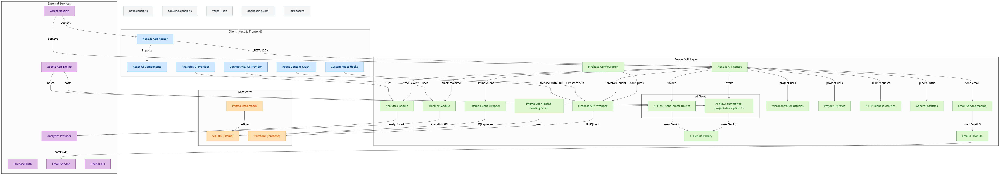

# StudKits - Your Electronics Project Companion

Welcome to StudKits - A dedicated platform that bridges the gap between electronics students and professional project development. Whether you're a student looking for project guidance or an educator seeking custom presentations, StudKits is your one-stop solution.
- Visit: [studkits.shop](https://www.studkits.shop)

<!-- ) -->
---
## 🎯 What is StudKits?

StudKits is a comprehensive web platform designed to support students and educators in the field of electronics. We understand the challenges faced by students in project development and documentation, which is why we've created a platform that provides:

- Custom electronics project assistance
- Professional presentation development
- Project tracking and management
- Expert consultation services
---
## 💡 Why StudKits?

- **Save Time**: Get expert guidance and avoid common project pitfalls
- **Professional Quality**: Access professionally designed presentations and documentation
- **Personalized Support**: Receive customized assistance for your specific needs
- **Educational Focus**: Created by students, for students, understanding academic requirements
---
## ✨ What We Offer

### 🈂️ Project Services
- Custom electronics project consultation
- Component selection guidance
- Circuit design review
- Implementation support
- Project documentation assistance

### 📊 Presentation Services
- Professional slide decks
- Technical documentation
- Project reports
- Research presentation templates

### 📱 User Experience
- Easy-to-use interface
- Seamless project tracking
- Quick response times
- Regular progress updates

---
## 🏗️ Project Architecture



---

## ⚙️ Installation / Setup Guide
Clone the repo and run it locally:  

```bash
git clone https://github.com/Mohitkadu16/studkits.git
cd studkits
npm install
npm run dev
```
---
## 👥 Who is it for?

- **Students**: Working on electronics projects or presentations
- **Educators**: Seeking custom teaching materials
- **Institutions**: Looking for project consultation services
- **Electronics Enthusiasts**: Needing expert guidance
---
## 🚀 Usage Guide

- Navigate the homepage to explore project services
- Request guidance for electronics projects
- Access professional presentation templates
- Track project progress in real time
---
## 🛠 Tech Stack

- Frontend: React, Next.js, Tailwind CSS
- Backend & Database: Prisma, Firebase
- Deployment: Vercel
---
## 🤝 Contributing

- Contributions are welcome!
- Fork the repo
- Create a new branch (feature-name)
- Commit changes
- Submit a Pull Request
---
## 📜 License

```
This project is licensed under the GNU General Public License v3.0.

StudKits - Electronics Project Companion
Copyright (C) 2025 Mohit Kadu

This program is free software: you can redistribute it and/or modify  
it under the terms of the GNU General Public License as published by  
the Free Software Foundation, either version 3 of the License, or  
(at your option) any later version.

This program is distributed in the hope that it will be useful,  
but WITHOUT ANY WARRANTY; without even the implied warranty of  
MERCHANTABILITY or FITNESS FOR A PARTICULAR PURPOSE.  See the  
GNU General Public License for more details.

You should have received a copy of the GNU General Public License  
along with this program.  If not, see <https://www.gnu.org/licenses/>.
```

See the full license in the [LICENSE](./LICENSE)

---
## 👥 Contact Us

**Studkits**
- Gmail: studkits25@gmail.com
- Instagram: [@studkits.shop](https://www.instagram.com/studkits.shop/)

**Mohit Kadu**
- GitHub: [@Mohitkadu16](https://github.com/Mohitkadu16)
- Instagram: [@loyalmanuka](https://www.instagram.com/loyalmanuka/)
---

Made with ❤️ by Mohit Kadu aka Loyalmanuka
