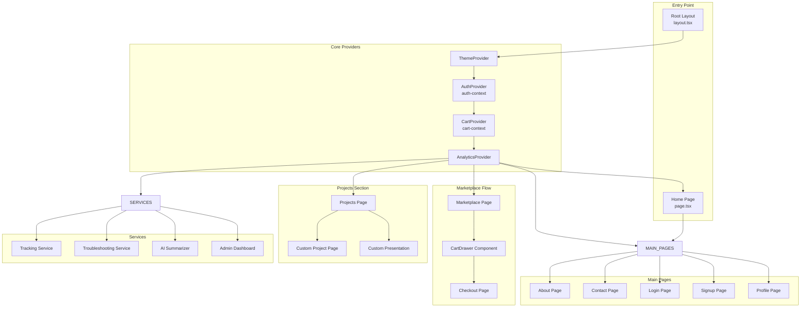
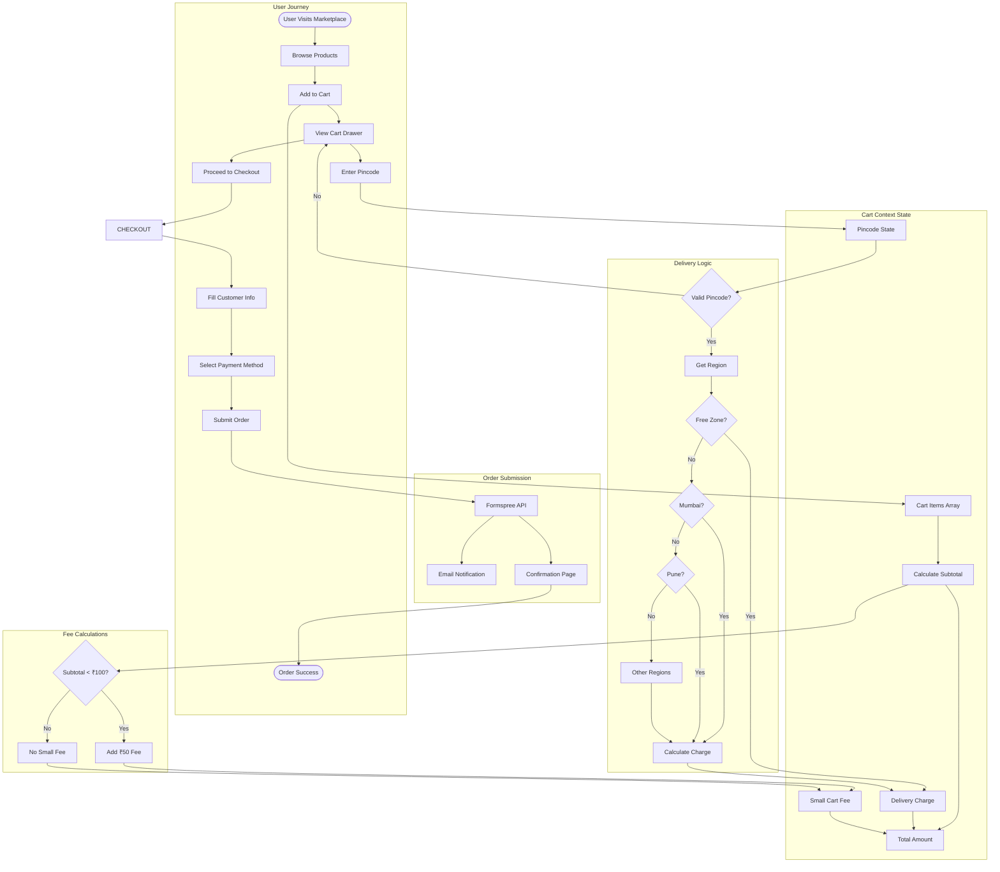
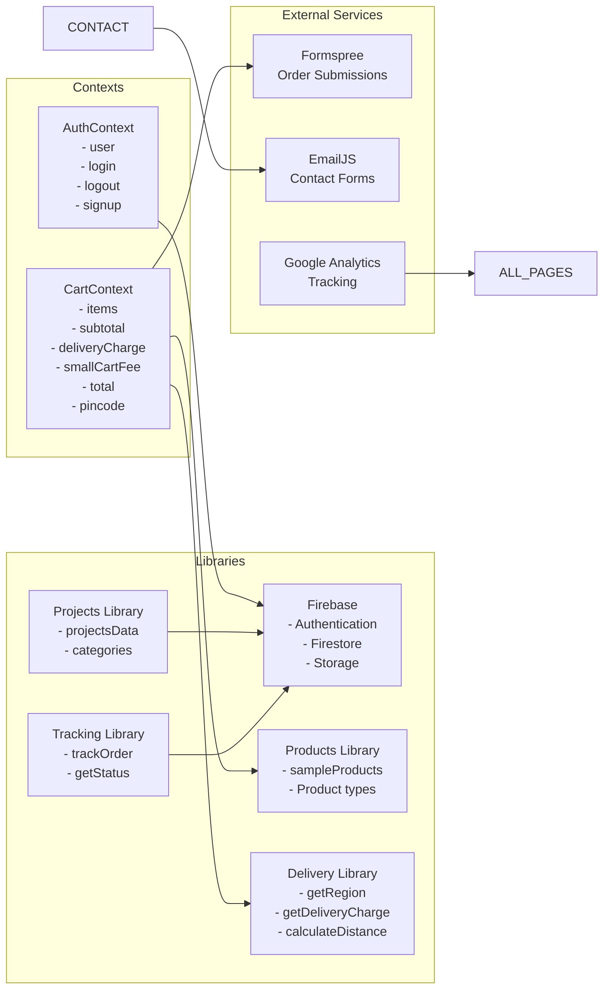
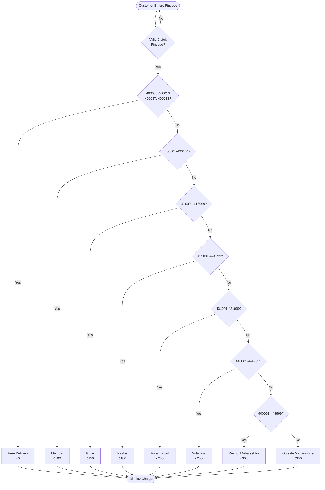
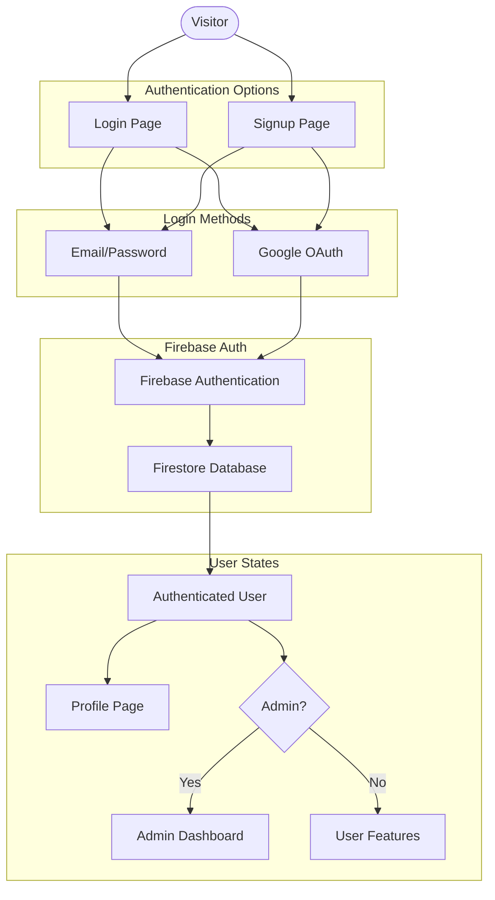
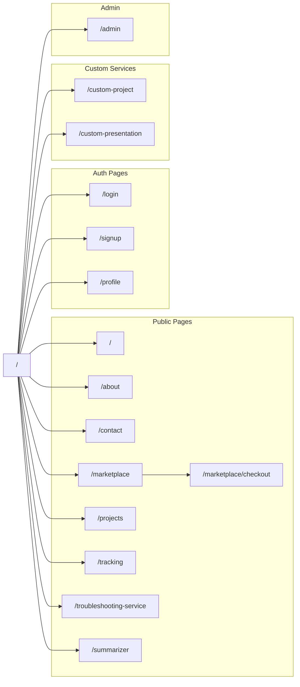
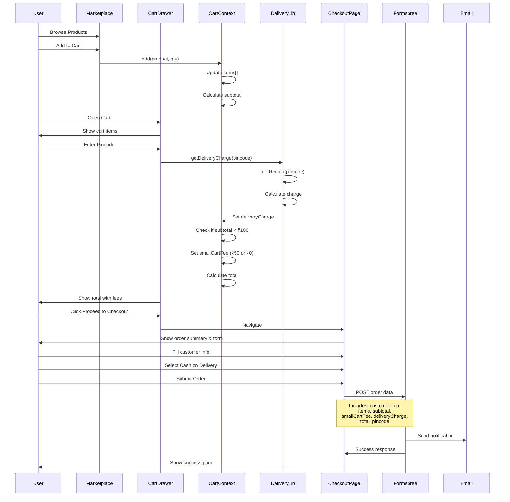

# StudKits Project - Complete Architecture Flowchart

This document contains comprehensive Mermaid flowcharts showing the entire StudKits project architecture.

## 1. Overall Application Architecture

## 2. Marketplace & Cart System Flow

## 3. Component Hierarchy

```mermaid
graph TB
    subgraph "Layout Components"
        NAVBAR[Navbar]
        FOOTER[Footer]
        MAX_WIDTH[MaxWidthWrapper]
    end

    subgraph "Marketplace Components"
        PRODUCT_CARD[ProductCard]
        FILTERS[FiltersSidebar]
        CART_DRAWER_COMP[CartDrawer]
    end

    subgraph "Project Components"
        PROJECT_CARD[ProjectCard]
        PROJECT_FILTER[ProjectFilter]
        PROJECT_DETAIL[ProjectDetail]
        MICROCONTROLLER[MicrocontrollerSelector]
    end

    subgraph "Admin Components"
        ADMIN_DASH[AdminDashboard]
        PROJECT_MANAGE[ProjectManagement]
        USER_MANAGE[UserManagement]
    end

    subgraph "Tracking Components"
        TRACK_FORM[TrackingForm]
        TRACK_RESULT[TrackingResult]
    end

    subgraph "Troubleshooting Components"
        TROUBLE_FORM[TroubleshootingForm]
        TROUBLE_RESULT[TroubleshootingResult]
        AI_SUGGEST[AISuggestions]
    end

    subgraph "UI Components"
        BUTTON[Button]
        INPUT[Input]
        CARD[Card]
        DIALOG[Dialog]
        TOAST[Toast/Toaster]
        DROPDOWN[Dropdown]
    end

    NAVBAR --> MAX_WIDTH
    FOOTER --> MAX_WIDTH

    PRODUCT_CARD --> BUTTON
    PRODUCT_CARD --> CARD
    FILTERS --> DROPDOWN
    CART_DRAWER_COMP --> BUTTON
    CART_DRAWER_COMP --> INPUT

    PROJECT_CARD --> CARD
    PROJECT_CARD --> BUTTON
    PROJECT_FILTER --> DROPDOWN
    MICROCONTROLLER --> DROPDOWN

    ADMIN_DASH --> PROJECT_MANAGE
    ADMIN_DASH --> USER_MANAGE

    TRACK_FORM --> INPUT
    TRACK_FORM --> BUTTON
    TRACK_RESULT --> CARD

    TROUBLE_FORM --> INPUT
    TROUBLE_RESULT --> AI_SUGGEST
```

## 4. Data Flow & State Management

## 5. Regional Delivery Pricing System

## 6. Authentication Flow

## 7. Complete Page Routes

## 8. Order Processing Flow

## Key Features Summary

### 1. **Marketplace System**

- Product browsing with filters
- Shopping cart with real-time updates
- Regional delivery pricing
- Small cart fee for orders < ₹100

### 2. **Delivery Pricing**

- Free delivery for 8 specific pincodes
- Regional rates for Maharashtra
- ₹100-₹350 based on location

### 3. **Fee Structure**

- Small cart fee: ₹50 for orders < ₹100
- Delivery charges: ₹0-₹350 based on region
- Dynamic total calculation

### 4. **Order Management**

- Formspree integration for order emails
- Complete order metadata tracking
- Cash on Delivery payment

### 5. **Additional Services**

- Project showcase and custom projects
- Order tracking system
- AI-powered troubleshooting
- Document summarizer
- Admin dashboard

### 6. **Tech Stack**

- **Framework**: Next.js 14 (App Router)
- **Styling**: Tailwind CSS
- **Authentication**: Firebase Auth
- **Database**: Firestore
- **Forms**: Formspree, EmailJS
- **Analytics**: Google Analytics
- **State**: React Context API
